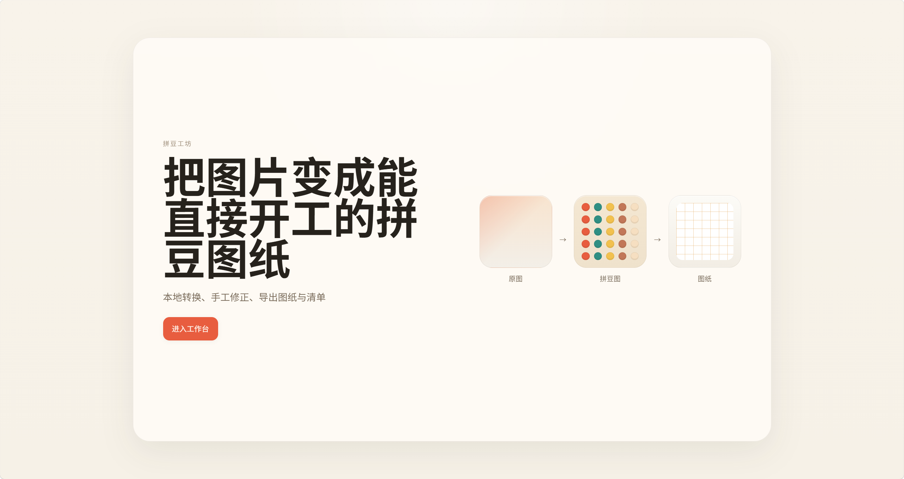
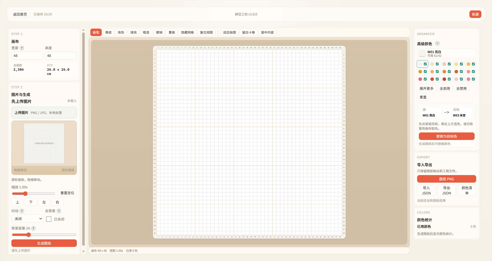
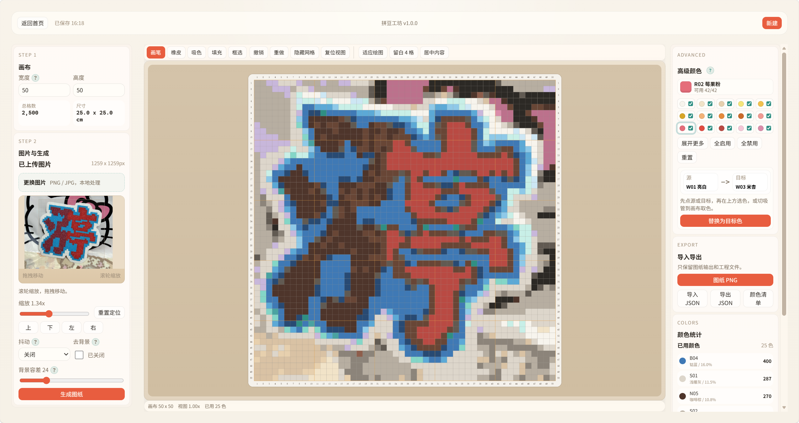
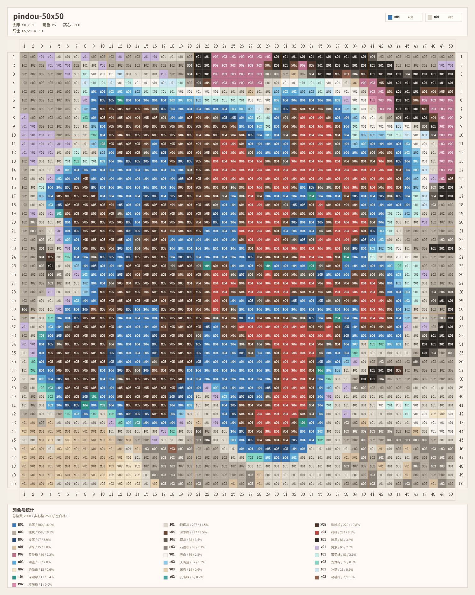
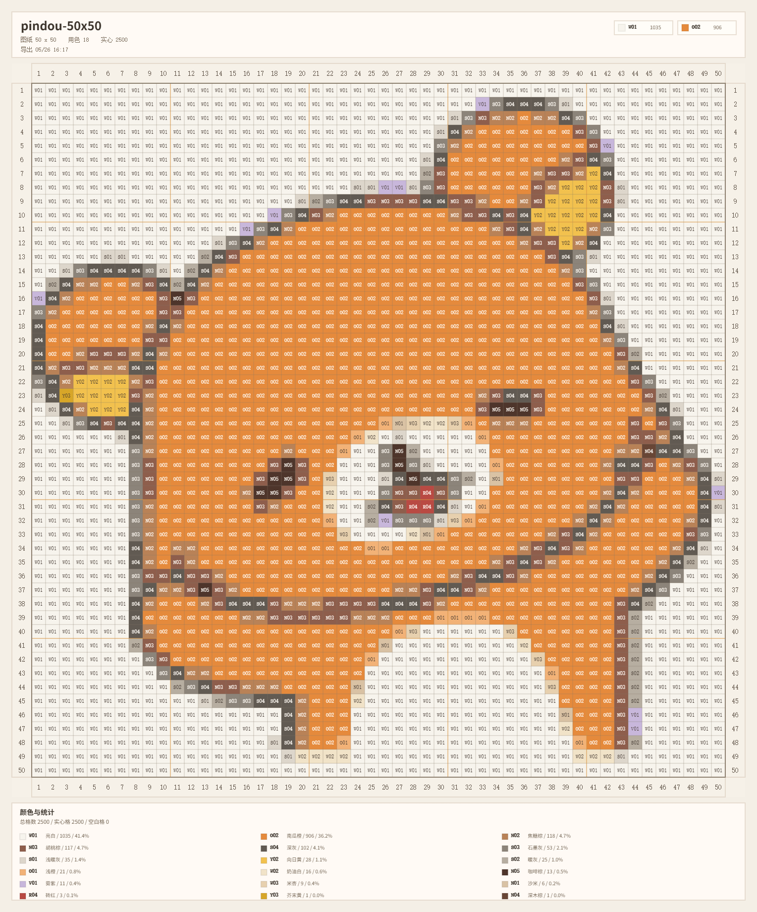

# 拼豆工坊

拼豆工坊是一个纯前端拼豆图纸编辑器，用来把图片转换成可直接开工的拼豆图纸，并支持在浏览器里继续修图、整理画布、导出图纸与工程文件。

## 当前版本

- `v1.0.2`
- 发布日期：`2026-05-27`

## 线上地址

- https://pindou.javai.cn

## 项目定位

- 本地处理：不依赖后端，图片、画布、图纸转换都在浏览器内完成
- 拼豆图纸编辑：支持画布创建、图片生成图纸、手工修图、颜色替换、导出
- 工作台式交互：三栏编辑器布局，画布在中间独立舞台内操作

## 界面预览

### 首页



### 编辑器




### 成品图纸




## 已完成功能

- 首页单屏入口，直接进入工作台
- 画布宽高设置，支持内容保留式缩放画布
- 图片上传、缩放、平移、预览
- 图片转拼豆图纸
- 可选抖动处理
- 可选去背景与容差调节
- iPad / 触屏基础适配：双指缩放与平移画布、双指缩放图片、显式移动画布工具、触控帮助
- 四边坐标尺显示
- 画笔、橡皮、吸色、填充、框选
- 选区复制、剪切、粘贴、移动、填充、清空
- 颜色替换，支持源色/目标色独立指定
- 高级颜色启用/禁用控制
- 编辑器顶部项目信息弹层，提供开源项目入口、版本号与反馈邮箱
- 适应绘图、留白、居中整理
- 撤销 / 重做
- 本地缓存保存当前工程
- 导出图纸 PNG、颜色清单、工程 JSON

## 技术栈

- `Vite`
- `React 19`
- `TypeScript`
- `Zustand`
- `Canvas 2D`
- 浏览器本地存储 `localStorage`

## 开发提示

- 本项目已内置 Codex 开发 skill：`skills/pindou-dev/`
- 使用 Codex 或其他兼容 skill 的 AI 开发工具接手本项目时，优先加载这份 skill，再开始阅读代码和实现需求
- skill 中已经整理了项目定位、产品约束、代码地图、验证要求和当前高优先级开发方向

## 目录结构

```text
docs/
  images/                   README 预览截图
skills/
  pindou-dev/               项目专用 Codex 开发 skill
    agents/
      openai.yaml           skill UI 元信息
    SKILL.md                项目约束、代码地图、验证流程
src/
  components/ui/            通用按钮、面板等基础 UI
  features/home/            首页与新建画布入口
  features/editor/          编辑器主流程、状态、图纸生成、舞台组件、图片预览
    helpContent.ts          编辑器帮助中心内容源，统一维护字段说明与工具文档
  features/palette/         拼豆颜色数据
  shared/types/             公共类型定义
  styles/                   tokens 与全局样式
README.md                   项目说明、预览、路线图
CHANGELOG.md                版本变更记录
```

## 本地开发

```bash
npm install
npm run dev
```

构建生产版本：

```bash
npm run build
```

## 架构说明

- 状态管理集中在 `src/features/editor/editorStore.ts`
- 图纸生成逻辑集中在 `src/features/editor/quantizeImage.ts`
- 中间画布舞台由 `CanvasStage` 负责渲染与交互
- 图片定位预览与正式图纸生成分离，避免调整图片参数时直接破坏当前图纸
- 当前版本只保留一份本地缓存工程，不再维护多项目列表
- 编辑器帮助说明统一收口在 `src/features/editor/helpContent.ts`，不要把帮助文案重新散写回各个组件

## 版本范围

`v1.0.2` 在 `v1.0.1` 的基础上继续补齐平板触控链路，重点完善 iPad 上的画布缩放、视图平移、图片定位和触控帮助。

## 帮助中心维护约定

- 编辑器里的字段说明、工具说明、触控说明、搜索关键词，统一维护在 `src/features/editor/helpContent.ts`
- 新增帮助内容时，优先补充已有条目或新增帮助条目，不要直接把长说明写进 `EditorPage.tsx`
- 帮助入口只负责打开对应条目，正文内容应始终来自帮助内容源
- 后续如果扩展完整文档中心、搜索命中高亮、最近查看记录，继续复用这份结构化数据

## 后续开发计划

### 近期计划

- 更细的工具栏与状态栏打磨
- 更完整的禁用态与悬浮提示统一
- 更稳定的撤销/重做回归测试
- 更好的颜色筛选与库存导向工作流
- 功能名称：智能背景去除
  实现方式：将当前基于四角平均色的简单去背景升级为基于图片四边采样的背景识别流程。先从画面四边提取背景候选色，再用容差控制做泛洪扩散，识别与边缘背景连续相连的区域并转为透明，最后补一轮边缘净化，减少白边、彩边和残留底色对后续拼豆量化的干扰。
- 功能名称：边缘杂色一键清理
  实现方式：在图片完成拼豆量化后，对生成的 `BeadGrid` 做二次分析。识别边缘位置和小面积连通域中的异常颜色块，重点处理 1 到 2 格、被主体颜色包围、与周边主色差异明显的跳色点，再按邻接颜色占比自动替换为周围主色，用来解决描边不干净、轮廓边缘颜色不一致的问题。
- 功能名称：仅处理边缘的颜色替换
  实现方式：在现有颜色替换能力上增加“仅处理边缘”模式。用户先指定源色和目标色，系统只在边缘区域、外轮廓附近或小面积边界连通域内执行替换，不影响画面主体大面积用色。这样既保留手动可控性，也能提高修正边缘杂色时的效率。
- 功能名称：生成前预处理与生成后修正解耦
  实现方式：把“图片定位预览”“背景去除”“正式生成图纸”“边缘净化”拆成更清晰的流水线。调整上传图的缩放、平移、去背景参数时，只更新预览层，不直接改动当前画布；只有点击“生成图纸”时，才按完整流程重新计算拼豆结果并覆盖画布，避免误操作清空当前编辑内容。

### 中期计划

- 图纸打印版优化
- 导出模板和页眉页脚规范化
- 更强的批量颜色替换与统计分析
- 功能名称：颜色清洗参数面板
  实现方式：把去背景、背景容差、边缘清理、边缘强度、仅处理边缘替换等参数收敛到同一个图片处理面板中，统一交互层级，并为每个参数补充悬浮提示、默认值和禁用态说明，避免当前设置分散导致的理解和操作成本。
- 功能名称：颜色替换工作流优化
  实现方式：在现有源色/目标色替换基础上，补充从画布吸色、从调色板选色、按统计列表快速定位颜色等入口。目标是把“发现杂色 -> 选中源色 -> 指定目标色 -> 局部或边缘替换”串成一条更短的修图路径。
- 功能名称：图纸生成质量评估
  实现方式：在生成结果旁增加颜色数量、孤立像素数量、边缘杂色数量、透明区域占比等基础指标，用来提示用户当前图纸是否存在过多碎色、小噪点或背景残留，并为后续自动优化提供判断依据。

### 长期方向

- 更贴近专业像素编辑器的交互体验
- 更完整的拼豆颜色体系与品牌配置
- 可选的作品模板、尺寸预设、配色规则
- 功能名称：可配置的拼豆量化策略
  实现方式：把颜色量化从单一最近色匹配扩展为可配置策略，例如优先少色、优先保边、优先亮度还原、优先库存可用色等模式，让不同类型的图片在生成图纸时可以选择更合适的转换方向。
- 功能名称：品牌化颜色库与材料约束
  实现方式：在现有调色板基础上扩展品牌、系列、库存和停产状态等维度，让图纸生成不只考虑“颜色接近”，还可以考虑“实际能买到”“当前库存够不够”“是否允许混用品牌”等真实制作约束。
